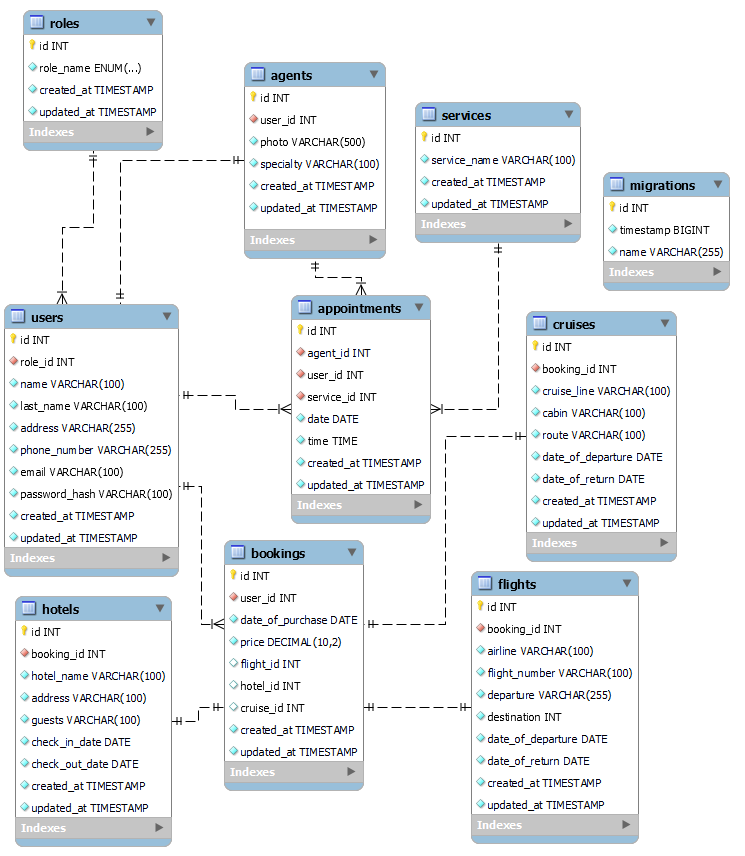

<h1 align="center">  
</h1>

## Project Content

<details>
  <summary>Content 📝</summary>
<ol>
  <a href="#"></a></li>
  <li><a href="#objective">Objective</a></li>
  <li><a href="#description">Description</a></li> 
  <li><a href="#technologies-used">Technologies Used</a></li>
  <li><a href="#db-diagram">DB Diagram</a></li>
  <li><a href="#installation">Installation</a></li>
  <li><a href="#endpoints">Endpoints</a></li>
  <li><a href="#acknowledgements">Acknowledgements</a></li>
  <li><a href="#contact">Contact</a></li>
</ol>
</details>

## Objective


This project embarked on the creation of a sophisticated API intricately woven with a versatile database, meticulously tailored to accommodate the diverse array of relationships pivotal to the TravelBlaze application's functionality.


## Description

Our backend system empowers users to seamlessly register, log in, and request appointments with our agents to plan their dream vacations. Furthermore, users can delve into the intricacies of their bookings, gaining comprehensive insights into their travel itineraries.

In addition, our platform enables agents to efficiently manage their daily appointments, facilitating meticulous planning and the delivery of top-notch services to clients. Agents also have the capability to create bookings, ensuring that users have access to their travel plans upon logging in.

Moreover, advanced functionalities cater to super admins, granting them the authority to list and delete users, appointments, and bookings. Furthermore, they possess the ability to onboard new agents, ensuring the seamless expansion of our elite team.

## Technologies Used

<div align="center">


 </div>

## DB Diagram

The diagram shows that each user will have a role assigned, which can be customer for clients, agent for workers, or superadmin for those responsible for managing the application.

On the other hand, each client can book an appointment with the travel agent of their choice, and the agents will be able to see all the appointments that have been booked with them.

<div style="text-align: center;">
 
</div>

## Installation

- Clone the repository.
- Run `$ npm install`.
- Connect your repository to the database.
- Run migrations `$ npm rundb:migrate`.
- Run `$ npm run dev`.

The application will be accessible via [http://localhost:5173/](http://localhost:5173/) for the frontend and [http://localhost:3000/](http://localhost:3000/) for the backend.

## Endpoints

<details>
<summary>USERS ENDPOINTS</summary>

- USERS

  - REGISTER

          POST http://localhost:3000/user/register

    body:

    ```js
        {
            "name":"Waiter",
            "last_name":"Newis",
            "address":"461 Kim Circle",
            "email":"wnewis2@diigo.com",
            "password":"123456",
            "phone_number":"123456789"
        }
    ```

      - REGISTER NEW AGENT

          POST http://localhost:3000/user/createagent

    body:

    ```js
        {
            "name":"Waiter",
            "last_name":"Newis",
            "address":"461 Kim Circle",
            "email":"wnewis2@diigo.com",
            "password":"123456",
            "phone_number":"123456789",
            "photo":"http://",
            "specialty": "continent"
        }
    ```

  - LOGIN

          POST http://localhost:3000/user/login

    body:

    ```js
        {
            "email": "wnewis2@diigo.com",
            "password": "123456"
        }
    ```

  - PROFILE

          GET http://localhost:3000/user/:id

    - Insert the user ID to display all data.

  - UPDATE

          PATCH http://localhost:3000/user/:id

    body:

    ```js
        {
            "name": "NewUserNew  ",
            "password": "NewPrinces1234@",
            "phone_number": "55555559"
        }
    ```

  - GET ALL AGENTS

          GET http://localhost:3000/get/agents

  - GET ALL USERS

          GET http://localhost:3000/users/allusers

  - REMOVE USER

          DELETE http://localhost:3000/users/:id


</details>
<details>
<summary>APPOINTMENTS ENDPOINTS</summary>

- APPOINTMENTS

  - CREATE

          POST http://localhost:3000/appointments/newAppointment

    body:

    ```js
        {
            "user_id": "1",
            "agent_id": "1",
            "service_id": "1",
            "date": "2024/03/28",
            "time": "14:00"
        }

    ```

  - UPDATE

          PATCH http://localhost:3000/appointments/:id

    body:

    ```js
        {
            "user_id": "1",
            "date": "2024-03-29",
            "time": "14:00"
        }
    ```

  - DELETE

          DELETE http://localhost:3000/appointments/:id

  - GET ALL APPOINTMENTS BY CUSTOMER

          GET http://localhost:3000/appointments/user/:id

  - GET ALL APPOINTMENTS BY AGENT

          GET http://localhost:3000/appointments/agent/:id

  - GET ALL APPOINTMENTS 

          GET http://localhost:3000/appointments/allappointments

</details>

<details>
<summary>BOOKINGS ENDPOINTS</summary>

- BOOKINGS

  - CREATE

          POST http://localhost:3000/bookings/newbooking

    body: (flights/hotels/cruises)

    ```js
        {
            "user_id": "1",
            "date_of_purchase": "2024/03/28",
            "price": "399$",
            "airline": "RYANAIR",
            "flight_number": "FR780",
            "date_of_departure": "2024/03/28",
            "date_of_return": "2024/03/30",
            "departure": "Valencia, Es",
            "destination": "Caracas, Ve"
        }

    ```

  - DELETE

          DELETE http://localhost:3000/bookings/:id

  - GET ALL BOOKINGS

          GET http://localhost:3000/bookings/allbookings

  - GET ALL BOOKINGS BY USER

          GET http://localhost:3000/bookings/mybookings/:id

</details>

## Acknowledgements

I want to express my sincere gratitude to my colleagues. Although we worked on individual projects, their constant support and willingness to share ideas were crucial in overcoming the challenges that arose during development. Together, we demonstrated exceptional commitment, unparalleled creativity, and unmatched collaboration.

<strong>Erika Orlando</strong><br>
<a href="https://github.com/AkireOrl">

</a>

<strong>Hector Soriano</strong><br>
<a href="https://github.com/HSoriano99">

</a>

## Author

- **Gabriel Escudillo**

## Contact

<a href = "gabrielescudillo@gmail.com"  target="_blank">

</a>
<a href="https://github.com/GabrielEscudillo"  target="_blank">
    
</a>  
<a href="https://www.linkedin.com/in/gabriel-escudillo-b8b436134/" target="_blank">

</a>
